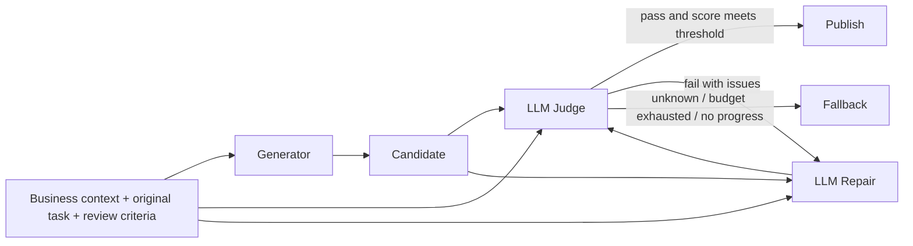

# VerifiGen

**Review generated content with an LLM Judge, then repair it against a structured issue list.**

[中文说明](README.zh-CN.md) · [Architecture](docs/architecture.md) · [RAG scenario](docs/rag_policy.md) · [Evaluation](docs/evaluation.md)

[](https://github.com/yufen0922/verifigen/actions/workflows/ci.yml)

v0.2.0 Alpha · Python 3.11+ · MIT

## What it does

VerifiGen turns a single model generation into a bounded quality loop:



The Judge receives the original prompt, full business context, explicit criteria, current candidate,
and prior verdicts. It returns `pass`, `fail`, or `unknown`, a score from 0 to 1, and a structured
issue list. The Repairer receives the same context and only revises the reported problems; every
revision must pass through the Judge again.

The Python runtime owns immutable context snapshots, Judge/Repair JSON protocols, call and repair
budgets, deadlines, token limits, no-progress detection, metadata-only traces, and fail-closed
fallbacks. The LLM handles open-ended semantics such as factual grounding, completeness,
relevance, and wording quality.

## Model adapter

The live examples use Alibaba Cloud Bailian's OpenAI-compatible API and default to `qwen3-8b`
with thinking enabled:

```python
stack = make_qwen3_8b_stack(
    api_key=os.environ["DASHSCOPE_API_KEY"],
    thinking_budget=2048,
)
loop = QualityLoop(
    generator=stack.generator,
    judge=stack.judge,
    repairer=stack.repairer,
)
```

Generator, Judge, and Repairer use separate adapters. They may share one model, as above, or be
configured independently. API keys are accepted only through runtime arguments or environment
variables and are never written to source files or quality traces.

## Quick start

Run the deterministic replay first to inspect the Judge -> Repair -> re-Judge control flow without
an API key:

```bash
python -m venv .venv
source .venv/bin/activate
python -m pip install -e ".[llm]"
verifigen demo
python examples/rag_qa/run.py
```

Replay verdicts and repairs are fixtures, not model-quality evidence. To run the live RAG path:

```bash
export DASHSCOPE_API_KEY="set-it-in-this-shell-only"
python examples/rag_qa/run_qwen.py
```

To force an initial answer with a factual error and a fabricated citation, then observe live repair:

```bash
python examples/rag_qa/run_qwen.py --repair-demo --output runs/rag-repair.json
```

The output contains retrieved passages, each Judge status/score/issue list, repair count, token
usage, and the final released or fallback answer. The repository contains no credentials.

A full 180-case `qwen3.5-flash` run is published as a
[summary report](benchmarks/results/qwen3.5-flash-180/report.md) and
[per-case records](benchmarks/results/qwen3.5-flash-180/records.jsonl). Interpret the numbers with
the model version, thinking budget, sample distribution, and independent oracle; never mix replay
scores into live-model metrics.

## Evaluation

The single-scenario RAG suite has 60 deterministically generated cases:

```bash
python examples/rag_qa/evaluate_qwen.py --limit 6 --output runs/rag-qwen-eval.json
python examples/rag_qa/evaluate_qwen.py --limit 60 --output runs/rag-qwen-eval-full.json
```

[scripts/build_rag_eval.py](scripts/build_rag_eval.py) generates cases for six product categories,
covering correct drafts, cross-category contamination, incorrect time limits, reversed conditions,
incorrect shipping fees, omissions, missing or fabricated citations, and unsupported promises.
An independent claim-level scorer evaluates final correctness instead of trusting the Judge's own
verdict.

The multi-scenario suite contains 180 cases: 60 each for RAG, customer support, and data-to-text.
Every scenario runs the same `QualityLoop`; only the `QualityTask`, criteria, output schema,
renderer, and independent oracle change:

```bash
python scripts/build_multiscenario_eval.py
python examples/multi_scenario/evaluate.py --mode offline --limit-per-scenario 60
python examples/multi_scenario/evaluate.py --mode qwen --limit-per-scenario 60
```

Offline mode verifies labels, adapters, and loop mechanics; it is not model accuracy. Qwen mode
requires `DASHSCOPE_API_KEY`, and scenario-specific oracles independently rescore the final output.

## SDK example

```python
import asyncio
import os

from verifigen import Criterion, QualityLoop, QualityTask, make_qwen3_8b_stack


async def main():
    stack = make_qwen3_8b_stack(api_key=os.environ["DASHSCOPE_API_KEY"])
    task = QualityTask(
        source={"order": {"paid": 799, "status": "shipped"}},
        prompt="Tell the customer the paid amount and shipping status.",
        criteria=(
            Criterion("grounding", "Amount and status must match the order record."),
            Criterion("completeness", "The response must include both amount and status."),
        ),
        output_schema={"type": "object", "required": ["answer"]},
    )
    result = await QualityLoop(
        generator=stack.generator,
        judge=stack.judge,
        repairer=stack.repairer,
    ).run(task)
    print(result.status, result.text)


asyncio.run(main())
```

## Repository layout

| Path | Responsibility |
|---|---|
| `src/verifigen/quality.py` | Bounded generate, judge, repair, and re-judge loop |
| `src/verifigen/agents.py` | LLM Judge/Repair adapters, Qwen factory, and test doubles |
| `src/verifigen/review.py` | Task, criterion, verdict, issue, budget, and result models |
| `src/verifigen/generators.py` | OpenAI-compatible Chat Completions adapter |
| `src/verifigen/retrieval.py` | Local BM25 retrieval used by the RAG example |
| `src/verifigen/domains/` | Scenario-specific criteria, schemas, and renderers |
| `src/verifigen/scenario_eval.py` | Independent support and report evaluation oracles |
| `examples/` | Offline replays, live Qwen entry points, and evaluation datasets |
| `benchmarks/` | Reproducible fixtures and published aggregate/live results |
| `tests/` | Protocol, budget, timeout, fallback, and scenario behavior tests |

The deterministic v0.1 `Contract` and `Harness` remain as a compatibility layer for constraints
that machines can enforce exactly, such as numeric types, enums, and ID allowlists. They are no
longer presented as the solution for open-ended language review.

## Scope and limitations

- An LLM Judge improves coverage for open text but is not a proof system and can misclassify.
- Production evaluation needs independently labeled data, false-positive/negative rates, repair
  regressions, latency, and token cost.
- `pass` means the current model accepted the current evidence and criteria; it does not make
  upstream data true.
- Do not stream an unreviewed candidate directly to the final user.
- High-risk systems still need deterministic authorization, transaction, amount, and citation-ID
  gates.

[Changelog](CHANGELOG.md) · [Roadmap](ROADMAP.md) · [Contributing](CONTRIBUTING.md) · [MIT License](LICENSE)
