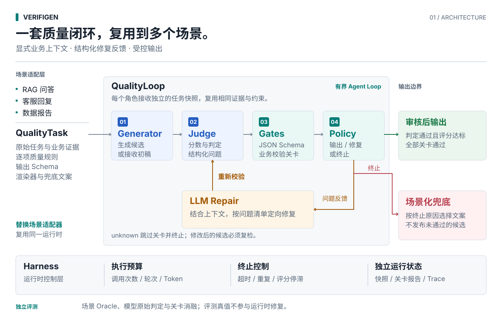

# VerifiGen

**面向多场景的 LLM 输出质量控制运行时：校验、修复、评分与兜底输出。**

[English](README.md) · [架构](docs/architecture.md) · [RAG 场景](docs/rag_policy.md) · [评测方法](docs/evaluation.md) · [RAGTruth 公开集](docs/ragtruth_evaluation.md)

[](https://github.com/yufen0922/verifigen/actions/workflows/ci.yml)

v0.2.0 Alpha · Python 3.11+ · MIT

## 它做了什么

VerifiGen 把一次大模型生成变成一个有边界的质量闭环：

<picture>
  <source media="(prefers-color-scheme: dark)" srcset="docs/assets/architecture-zh-dark.svg">
  
</picture>

[查看大图](docs/assets/architecture-zh-light.svg) · [详细决策流程](docs/architecture.md#状态机)

Judge 不是只看最终答案。它同时拿到原始 prompt、完整业务上下文、逐项质量标准、
当前候选和历史判定，返回 `pass/fail/unknown`、0～1 分数以及结构化问题清单。
Repair 拿到同一份上下文和 Judge 问题，只修改错误内容，然后必须重新经过 Judge。

程序层负责上下文快照、Judge/Repair JSON 协议、调用次数、修复轮次、超时、Token 阈值、重复答案
检测、Trace 和降级；事实语义、完整性、相关性和表达正确性由 LLM 判断。
每次运行独立保存候选、历史判定、关卡报告、Token 观测和决策轨迹。

## 工程设计与源码入口

| 关注点 | 已实现能力 | 源码 |
|---|---|---|
| 通用框架 | 业务适配器提供上下文、规则、Schema、渲染器和兜底文案，核心运行时不导入业务模块 | [任务协议](src/verifigen/review.py)、[场景适配器](src/verifigen/domains) |
| 校验修复 | 各轮共享原始任务语义，每个角色接收独立数据副本，结构化反馈驱动修复 | [QualityLoop](src/verifigen/quality.py) |
| 评分决策 | 可单独测试的决策策略、评分阈值、可选的连续评分无提升终止 | [QualityPolicy](src/verifigen/policy.py) |
| 输出关卡 | 必经的 JSON Schema 校验、可插拔异步业务校验，失败问题进入修复 | [关卡协议](src/verifigen/gates.py)、[引用校验](src/verifigen/domains/rag_review.py) |
| 异常兜底 | 限制调用、轮次与耗时，检测重复候选，按终止原因选择场景文案 | [运行时](src/verifigen/quality.py) |
| 可观测性 | 保留原始模型判定、独立关卡报告，记录不含正文的配置与决策 Trace | [行为测试](tests/test_quality_controls.py) |

阅读顺序：[架构与决策表](docs/architecture.md) → [接入新场景](docs/scenario_integration.md) →
[RAGTruth 评测协议](docs/ragtruth_evaluation.md) → 核心运行时 → 行为测试。`QualityLoop` 承担当前
Harness 的职责；导出的 `Harness` 类是 v0.1 兼容接口。

## 现在使用的模型

真实示例默认使用百炼 `qwen3-8b`，并启用思考：

```python
stack = make_qwen3_8b_stack(
    api_key=os.environ["DASHSCOPE_API_KEY"],
    thinking_budget=2048,
)
loop = QualityLoop(
    generator=stack.generator,
    judge=stack.judge,
    repairer=stack.repairer,
)
```

三个角色使用独立适配器，当前默认是同一个 Qwen3-8B 模型，后续可以分别换成不同模型。
API Key 只从环境变量读取，不写入代码、配置示例或运行 Trace。

## 快速运行

先运行无需 Key 的固定回放，确认 Judge → Repair → 再 Judge 的控制流程：

```bash
python -m venv .venv
source .venv/bin/activate
python -m pip install -e ".[llm]"
verifigen demo
python examples/rag_qa/run.py
```

离线回放的判定与修复是预置结果，不代表模型效果。真实 RAG 链路：

```bash
export DASHSCOPE_API_KEY="在当前终端设置，不要写入仓库"
python examples/rag_qa/run_qwen.py
```

要强制输入一个带有错误事实和伪造引用的初稿，直接观察 Qwen3-8B 的校对与修复：

```bash
python examples/rag_qa/run_qwen.py --repair-demo --output runs/rag-repair.json
```

输出会包含检索片段、每轮 Judge 的状态/分数/issues、修复次数、Token 用量和最终发布答案。
仓库不内置密钥。一次真实 `qwen3.5-flash` 跨场景实验已公开保存为
[汇总报告](benchmarks/results/qwen3.5-flash-180/report.md)和
[180 条逐条记录](benchmarks/results/qwen3.5-flash-180/records.jsonl)；结果必须与模型版本、
thinking budget、样本分布和独立 oracle 一起解释，不能把离线回放分数混入真实模型指标。

已公开的基线为 **180 条合成样本、513 次真实模型调用、73.46% 错误初稿修复成功率（119/162）**。
这是 v0.2 的实验结果，不代表本次未发布的关卡和策略改动已取得同样效果。

项目同时已使用 [RAGTruth](https://github.com/ParticleMedia/RAGTruth) 构建第一阶段 600 条公开评测集：
QA、摘要、数据转文本各 200 条，每类包含 100 条有效幻觉样本和 100 条正常样本；开发集 180 条、
评测集 420 条，并按 `source_id` 隔离原始材料。RAGTruth 官方语料包含 2,965 个原始材料、17,790 条
模型回答和词级人工幻觉标注。当前已完成数据核验与固定抽样，尚未发布这 600 条上的 Qwen 完整运行
和修复后盲审指标；上面的 73.46% 仅属于 180 条合成集。详见
[RAGTruth 评测协议](docs/ragtruth_evaluation.md)。

单场景 RAG 评测使用确定性生成的 60 条样本：

```bash
python examples/rag_qa/evaluate_qwen.py --limit 6 --output runs/rag-qwen-eval.json
python examples/rag_qa/evaluate_qwen.py --limit 60 --output runs/rag-qwen-eval-full.json
```

数据集由 [scripts/build_rag_eval.py](scripts/build_rag_eval.py)
生成，覆盖 6 类商品的正确初稿、跨类别混用、错误期限、条件反转、错误运费、缺项、无引用、
伪造引用和额外承诺；最终正确性由独立的 claim 级评分器判断，而不是由 Judge 自评。

跨场景评测共 180 条：RAG、客服回复、数据转文本各 60 条。三个场景使用相同的
`QualityLoop`，只替换 `QualityTask`、质量标准、输出结构、发布渲染器和独立 oracle：

```bash
python scripts/build_multiscenario_eval.py
python examples/multi_scenario/evaluate.py --mode offline --limit-per-scenario 60
python examples/multi_scenario/evaluate.py --mode qwen --limit-per-scenario 60
```

离线模式用于验证数据标签、场景接线和完整循环，不是模型准确率；`qwen` 模式需要
`DASHSCOPE_API_KEY`，并用与 Judge 分离的场景 oracle 复核最终输出。

## SDK 用法

```python
import asyncio
import os

from verifigen import Criterion, QualityLoop, QualityTask, make_qwen3_8b_stack


async def main():
    stack = make_qwen3_8b_stack(api_key=os.environ["DASHSCOPE_API_KEY"])
    task = QualityTask(
        source={"order": {"paid": 799, "status": "shipped"}},
        prompt="向用户说明订单金额和状态。",
        criteria=(
            Criterion("grounding", "金额和状态必须符合订单记录。"),
            Criterion("completeness", "必须同时回答金额与状态。"),
        ),
        output_schema={"type": "object", "required": ["answer"]},
    )
    result = await QualityLoop(
        generator=stack.generator,
        judge=stack.judge,
        repairer=stack.repairer,
    ).run(task)
    print(result.status, result.text)


asyncio.run(main())
```

## 代码结构

| 路径 | 作用 |
|---|---|
| `src/verifigen/quality.py` | 生成、判定、修复、再判定的有界循环 |
| `src/verifigen/agents.py` | LLM Judge/Repair、Qwen3-8B 工厂和测试替身 |
| `src/verifigen/review.py` | Task、Criterion、Verdict、Issue、Budget、Result |
| `src/verifigen/policy.py` | 输出、修复、终止的独立决策策略 |
| `src/verifigen/gates.py` | JSON Schema 和异步业务校验扩展协议 |
| `src/verifigen/generators.py` | OpenAI-compatible Chat Completions 适配器 |
| `src/verifigen/retrieval.py` | RAG 示例用的本地 BM25 检索 |
| `src/verifigen/domains/rag_review.py` | 自然语言 RAG 判定标准和输出结构 |
| `src/verifigen/domains/support_review.py` | 客服场景的事实、退款状态、下一步和安全标准 |
| `src/verifigen/domains/report_review.py` | 数据转文本的数值、派生计算、单位和克制表达标准 |
| `src/verifigen/scenario_eval.py` | 客服和数据报告的独立确定性评测 oracle |
| `examples/rag_qa/` | 18 条原始政策、离线回放、真实 Qwen 入口、60 条评测样本 |
| `examples/multi_scenario/evaluate.py` | 统一运行三个场景、180 条样本的离线或 Qwen 评测 |
| `tests/test_quality.py` | 通过、修复、unknown、预算、超时、无进展等行为测试 |

v0.1 的确定性 `Contract/Harness` 仍保留为兼容层，可用于金额类型、枚举、ID 白名单等
机器可严格判断的约束，但它不再承担自然语言语义校对的核心职责。

## 能力边界

- LLM Judge 提高开放文本场景的适用性，但不构成数学证明；Judge 自身也会误判。
- 生产评测应使用人工标注集统计错误检出率、误杀率、修复成功率、回归率、延迟和 Token。
- `pass` 只表示当前模型在当前上下文、标准和阈值下通过，不表示上游数据一定真实。
- 不应在 Judge 通过前把流式候选直接展示给最终用户。
- 高风险业务仍应叠加权限、事务、金额上限、引用 ID 等确定性规则。

[Changelog](CHANGELOG.md) · [Roadmap](ROADMAP.md) · [MIT License](LICENSE)
