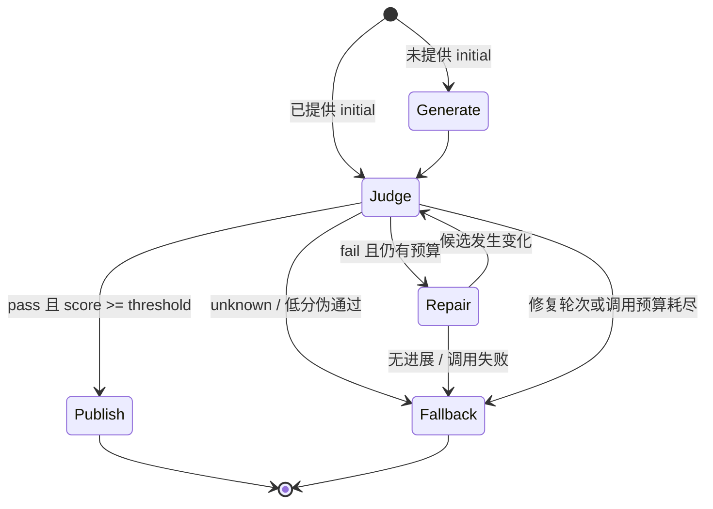

# v0.2 架构：LLM Judge + LLM Repair

## 核心原则

自然语言是否符合业务语义，不再由硬编码字段映射假装解决。VerifiGen v0.2 把 Qwen3-8B
这样的思考模型放在判定与修复中心；Python 运行时负责让这个过程可控、可观测、可停止。

一次 Judge 请求必须包含五类信息：

1. 原始生成任务 `prompt`；
2. 当次业务上下文 `source`，RAG 时就是问题与检索原文；
3. 明确、逐项编号的 `criteria`；
4. 当前 `candidate`；
5. 修复轮次和之前的判定历史。

仅把候选答案发给 Judge 会失去业务语境，容易导致判定漂移；仅把错误描述发给 Repair，
则可能修对一句、改错其他内容。因此 Judge 和 Repair 使用同一份任务快照。

## 组件关系

| 组件 | 职责 |
|---|---|
| `QualityTask` | 保存上下文、原始任务、质量标准、输出结构、发布渲染器和降级文案 |
| `LLMJudge` | 返回状态、分数、摘要、问题所属标准、证据和修复建议 |
| `LLMRepairer` | 根据问题清单改写候选，不自行改变任务目标 |
| `QualityLoop` | 控制生成、再判定、修复轮次、调用预算、超时和发布 |
| `CompatibleChatGenerator` | 调用 OpenAI-compatible Chat Completions API |
| `Qwen3Stack` | 为 Generator、Judge、Repairer 创建独立 Qwen3-8B 适配器 |

## 状态机



默认最多 7 次模型调用、2 轮修复、120 秒。完整生成并修复两轮时最多为：
1 次 Generator + 3 次 Judge + 2 次 Repair = 6 次，留 1 次余量。调用失败也计入预算。

## 结构化协议

Judge 必须返回：

```json
{
  "status": "fail",
  "score": 0.25,
  "summary": "答案与政策原文冲突",
  "issues": [
    {
      "criterion_id": "grounding",
      "message": "拆封条件错误",
      "evidence": "KB-HEADPHONE-OPENED 明确说明拆封后不适用",
      "suggestion": "按原文改写并引用该片段"
    }
  ]
}
```

Repair 必须返回 `revised_candidate` 和 `change_summary`。Pydantic 校验额外字段、缺字段、
未知状态和越界分数；协议异常不会被当作通过，而是 `judge_error` 或 `repair_error` 降级。

## 多场景适配

核心运行时不导入任何业务领域模块。一个新场景通过 `QualityTask` 提供六项配置：`source`、
`prompt`、`criteria`、`output_schema`、`renderer` 和 `fallback_text`。其中 `renderer` 只在
Judge 通过后把结构化候选转换为用户可见文本；渲染失败会变成 `renderer_error` 并走降级，
不会发布半成品。

当前三个场景共用同一个 `QualityLoop`：

| 场景 | 业务上下文 | 主要标准 | 发布形式 |
|---|---|---|---|
| RAG | 问题与检索原文 | 事实依据、引用、完整性 | 带引用答案 |
| 客服回复 | 订单与退款快照 | 事实、状态、下一步、越权承诺 | 四段客服文案 |
| 数据转文本 | 指标快照与单位 | 原始数值、派生计算、单位、禁止归因 | 指标摘要句 |

`src/verifigen/domains/*_review.py` 只负责业务适配；预算、修复轮次、历史判定、Trace、
无进展检测和 fail-closed 发布逻辑仍由核心循环统一处理。

## Qwen3-8B 配置

`make_qwen3_8b_stack` 默认连接百炼北京地域兼容端点，模型 ID 为 `qwen3-8b`，请求体包含：

```json
{"enable_thinking": true, "thinking_budget": 2048}
```

生成、Judge、Repair 三个角色不共享对话历史，只共享显式的 `QualityTask` 快照，避免角色串扰。
API Key 只通过函数参数进入适配器，Provider 异常信息会被脱敏。

## 确定性层的正确位置

LLM 负责开放语义，确定性代码仍适合处理：JSON Schema、枚举、金额范围、身份/权限、
引用 ID 是否存在、调用预算、幂等键和事务前置条件。旧版 `Contract/Harness` 暂时保留，
但文档和新 RAG 示例不再把它描述成通用语义验证器。

## 可观测性与评测

Trace 记录角色、状态、分数、criterion ID、耗时和 Token，不记录完整上下文、答案或 API Key。
`QualityResult.to_dict()` 会包含候选和问题文本，应视为敏感业务数据。

流程单测只能证明控制逻辑正确，不能证明模型判断准确。真实效果必须用未参与 prompt 设计的
人工标注集，至少报告：错误检出率、正确答案误杀率、修复后通过率、人工复核正确率、
平均修复轮次、P95 延迟和 Token 成本。
