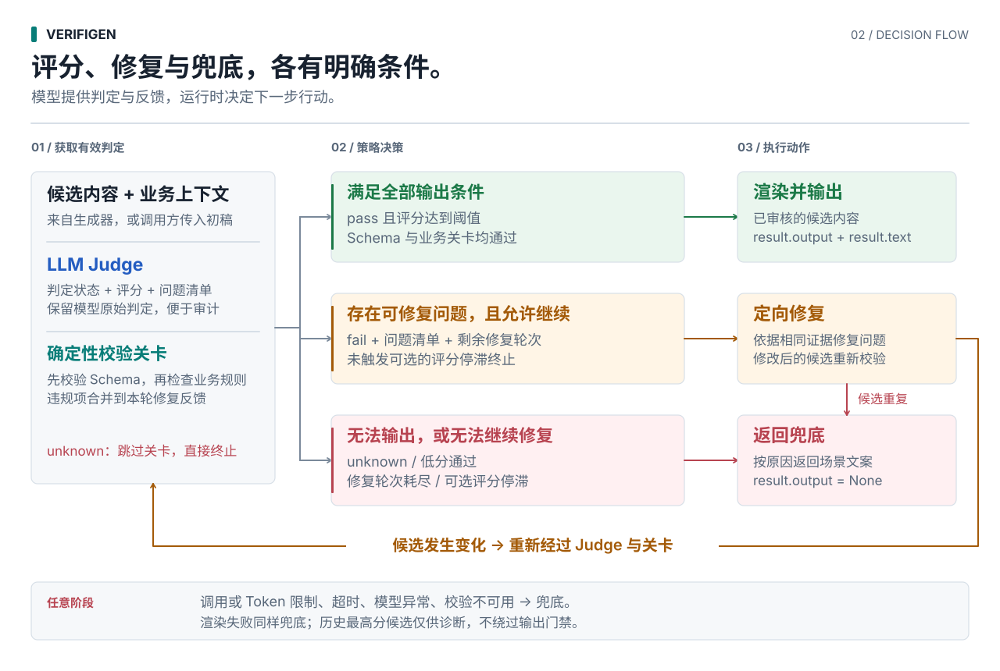

# 架构：上下文、质量判断与受控输出

## 核心原则

VerifiGen 以 LLM 完成语义判断和内容修复，使用确定性校验约束输出结构与业务不变量。
Python 运行时负责状态隔离、输出决策、预算和终止。场景适配层、模型适配层、决策策略
与核心循环分别演进。本文描述 main 的实现；v0.2 评测基线早于新增的输出关卡和评分停滞策略。

一次 Judge 请求必须包含五类信息：

1. 原始生成任务 `prompt`；
2. 当次业务上下文 `source`，RAG 时就是问题与检索原文；
3. 明确、逐项编号的 `criteria`；
4. 当前 `candidate`；
5. 修复轮次和之前的判定历史。

仅把候选答案发给 Judge 会失去业务语境，容易导致判定漂移；仅把错误描述发给 Repair，
则可能修对一句、改错其他内容。因此 Judge 和 Repair 使用同一份任务快照。
每次适配器调用获得该快照的独立副本，避免自定义代码修改嵌套字典后污染后续轮次。

## 组件关系

| 组件 | 职责 |
|---|---|
| `QualityTask` | 保存上下文、原始任务、质量标准、输出结构、发布渲染器和降级文案 |
| `LLMJudge` | 返回状态、分数、摘要、问题所属标准、证据和修复建议 |
| `LLMRepairer` | 根据问题清单改写候选，不自行改变任务目标 |
| `QualityLoop` | 控制生成、再判定、修复轮次、调用预算、超时和发布 |
| `QualityPolicy` | 纯函数式决策：输出、继续修复或兜底；支持可选评分停滞终止 |
| `SchemaGate` / `CandidateGate` | 校验输出结构与可确定检查的业务不变量，生成修复反馈 |
| `CompatibleChatGenerator` | 调用 OpenAI-compatible Chat Completions API |
| `Qwen3Stack` | 为 Generator、Judge、Repairer 创建独立 Qwen3-8B 适配器 |

## 状态机

<picture>
  <source media="(prefers-color-scheme: dark)" srcset="assets/decision-flow-zh-dark.svg">
  
</picture>

[查看大图](assets/decision-flow-zh-light.svg) · [English diagram](assets/decision-flow-en-light.svg) · [图源与维护](assets/README.md)

默认最多 7 次模型调用、2 轮修复、120 秒。完整生成并修复两轮时最多为：
1 次 Generator + 3 次 Judge + 2 次 Repair = 6 次，留 1 次余量。调用失败也计入预算。

所有模型调用执行前检查调用次数与已观测 Token；总超时包围整个执行过程，包含异步关卡。
`max_observed_tokens` 是响应后的观测阈值，单次响应仍可能超过它，并非服务端硬性 Token 配额。
自定义异步关卡需协作响应取消，不应在事件循环里执行阻塞 I/O 或长时间 CPU 工作。

## 输出决策与优先级

| 条件 | 行为 | reason |
|---|---|---|
| Schema 配置非法 | 模型调用前终止 | `invalid_schema` |
| Judge 无法判断 | 直接兜底，不用修复补造缺失证据 | `judge_unknown` |
| Schema 或业务关卡发现违规 | 追加结构化问题，将本轮有效判定设为 fail | 继续进入策略 |
| 校验关卡报错 | 停止，保留未通过状态 | `gate_error` |
| 有效判定 pass 且分数达标 | 渲染并输出 | `judge_passed` |
| 有效判定 pass 但分数过低 | 兜底，没有问题清单可供定向修复 | `score_below_threshold` |
| 判定 fail 且修复轮次已耗尽 | 兜底 | `repair_budget` |
| 判定 fail 且达到评分停滞窗口 | 兜底，可选且默认关闭 | `score_plateau` |
| 判定 fail 且允许继续 | 将问题清单交给 Repair | `issues_found` |
| 修复结果与任一历史候选相同 | 停止重复尝试 | `no_progress` |

评分停滞的配置为 `QualityPolicy(score_patience=2, min_score_gain=0.01)`：最近两轮的最高分
相较此前历史最高分提升不足 0.01 时终止。已满足通过条件的候选优先输出，不受停滞规则阻拦。
分数是模型估计，不能解释为正确率；不同 Judge 的评分尺度需通过评测校准。

兜底输出按 `QualityTask.fallback_by_reason[reason]` 选择，未配置时使用 `fallback_text`。
`output` 在兜底时为 `None`；`best_candidate` 仅用于诊断，不能因历史最高分而绕过发布门禁。
兜底文案可以提示转人工，但框架本身不创建人工工单。

## 确定性校验关卡

每轮模型判定之后，先运行必经的 Draft 2020-12 `SchemaGate`，再按顺序运行 `gates`。
Schema 错误时跳过后续业务关卡，以便它们可以依赖已验证的字段结构。修复后重跑相同的关卡。
所有关卡都只返回问题或报告不可用，不能自行放行候选。

Schema 支持本地 `$defs/$ref`，不自动读取网络或文件引用，`format` 不作为强制断言。
实现使用 [python-jsonschema 的 Registry 配置](https://python-jsonschema.readthedocs.io/en/stable/referencing/)。
每轮最多收集 20 个 Schema 问题，避免将过长的验证错误灌入修复提示词。

RAG 示例的 `CitationGate` 检查引用 ID 是否属于检索片段，以及行内引用与列表是否一致；
它不会证明“引用内容支持结论”，这仍交给语义 Judge。接入方法见[场景指南](scenario_integration.md)。

## 结构化协议

Judge 必须返回：

```json
{
  "status": "fail",
  "score": 0.25,
  "summary": "答案与政策原文冲突",
  "issues": [
    {
      "criterion_id": "grounding",
      "message": "拆封条件错误",
      "evidence": "KB-HEADPHONE-OPENED 明确说明拆封后不适用",
      "suggestion": "按原文改写并引用该片段"
    }
  ]
}
```

Repair 必须返回 `revised_candidate` 和 `change_summary`。Pydantic 校验额外字段、缺字段、
未知状态和越界分数；协议异常不会被当作通过，而是 `judge_error` 或 `repair_error` 降级。

## 多场景适配

核心运行时不导入任何业务领域模块。一个新场景通过 `QualityTask` 提供六项配置：`source`、
`prompt`、`criteria`、`output_schema`、`renderer` 和 `fallback_text`。其中 `renderer` 只在
Judge 通过后把结构化候选转换为用户可见文本；渲染失败会变成 `renderer_error` 并走降级，
不会发布半成品。

当前三个场景共用同一个 `QualityLoop`：

| 场景 | 业务上下文 | 主要标准 | 发布形式 |
|---|---|---|---|
| RAG | 问题与检索原文 | 事实依据、引用、完整性 | 带引用答案 |
| 客服回复 | 订单与退款快照 | 事实、状态、下一步、越权承诺 | 四段客服文案 |
| 数据转文本 | 指标快照与单位 | 原始数值、派生计算、单位、禁止归因 | 指标摘要句 |

`src/verifigen/domains/*_review.py` 只负责业务适配；预算、修复轮次、历史判定、Trace、
无进展检测和 fail-closed 发布逻辑仍由核心循环统一处理。

## Qwen3-8B 配置

`make_qwen3_8b_stack` 默认连接百炼北京地域兼容端点，模型 ID 为 `qwen3-8b`，请求体包含：

```json
{"enable_thinking": true, "thinking_budget": 2048}
```

生成、Judge、Repair 三个角色不共享对话历史，只共享显式的 `QualityTask` 快照，避免角色串扰。
API Key 只通过函数参数进入适配器，Provider 异常信息会被脱敏。

## 确定性层的正确位置

LLM 负责开放语义，确定性代码仍适合处理：JSON Schema、枚举、金额范围、身份/权限、
引用 ID 是否存在、调用预算、幂等键和事务前置条件。旧版 `Contract/Harness` 暂时保留，
但文档和新 RAG 示例不再把它描述成通用语义验证器。

## 可观测性与评测

Trace 记录角色、状态、分数、criterion ID、耗时和 Token，不记录完整上下文、答案或 API Key。
启动事件包含预算和策略配置，`decision` 事件包含动作与终止原因；`gate_checked` 只包含关卡序号和问题数量。
`QualityResult.verdicts` 保留模型原始判定；`gate_reports` 单独保留确定性关卡问题，使模型误放行与
运行时拦截能够分别分析。`QualityResult.to_dict()` 会包含候选和问题文本，应视为敏感业务数据。
发送给下一轮 Judge 和 Repair 的历史包含关卡合并后的有效反馈，避免模型看见之前的原始 PASS
而忽略实际发生的规则拦截。

共享一个 `QualityLoop` 的并发调用各自维护 run ID、候选、历史和预算。自定义模型适配器与关卡
必须无状态或并发安全；调用方取消会继续向上传播，总超时则转换为 `deadline` 兜底。

流程单测只能证明控制逻辑正确，不能证明模型判断准确。真实效果必须用未参与 prompt 设计的
人工标注集，至少报告：错误检出率、正确答案误杀率、修复后通过率、人工复核正确率、
平均修复轮次、P95 延迟和 Token 成本。
